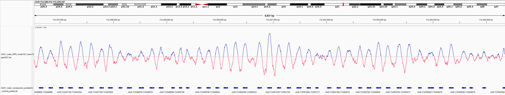
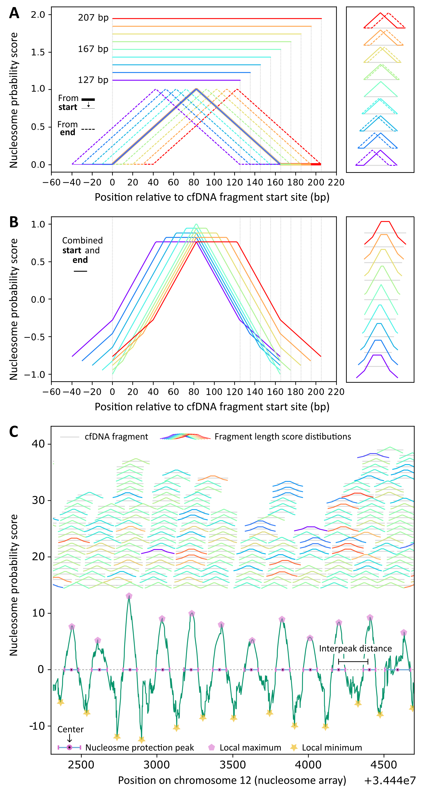

## Table of Contents

- [NPS with Nucleosome Peak Calling and Cut&Run Nucleosome Peak Clustering](#NPS-with-nucleosome-peak-calling-and-cutrun-peak-clustering)
- [Requirements](#requirements)
- [NPS: Nucleosome Probability Score](#NPS-nucleosome-probability-score)
  - [Key Concepts](#key-concepts)
- [`NPS_with_nucleosome_peak_calling.py`](#NPS_with_nucleosome_peak_callingpy)
  1. [Running on Individual Contigs](#1-running-on-individual-contigs)
  2. [Output Files](#2-output-files)
     - [Combined Scores (bedGraph) File Format](#a-combined-scores-bedgraph-file-format)
     - [Nucleosome Regions (bed) File Format](#b-nucleosome-regions-bed-file-format)
  3. [Post-processing](#3-post-processing)
- [`CutNRun_peak_clusterer.py`](#cutnrun_peak_clustererpy)
  - [Key Features](#key-features)
     - [Peak Classification](#peak-classification)
     - [Control Overlap Filtering](#control-overlap-filtering)
     - [Clustering](#clustering)
  1. [Running `CutNRun_peak_clusterer.py`](#1-running-cutnrun_peak_clustererpy)
  2. [Output Files](#2-output-files)
     - [Filtered Peaks (.bed)](#a-filtered-peaks-bed)
     - [Cluster Details (.txt)](#b-cluster-details-txt)
     - [Cluster Peaks (.bed)](#c-cluster-peaks-bed)
  3. [Clustering Algorithm](#3-clustering-algorithm)
  4. [Example Output of Cluster Details](#4-example-output-of-cluster-details)
  5. [Example: Running the Peak Clusterer](#5-example-running-the-peak-clusterer)
- [How to Use](#how-to-use)
  1. [Running `NPS_with_nucleosome_peak_calling.py` on Individual Contigs](#1-running-NPS_with_nucleosome_peak_callingpy-on-individual-contigs)
  2. [Concatenating BedGraph Files](#2-concatenating-bedgraph-files)
  3. [Converting BedGraph to BigWig](#3-converting-bedgraph-to-bigwig)
  4. [Converting Nucleosome Regions to NarrowPeak Format](#4-converting-nucleosome-regions-to-narrowpeak-format)
  5. [Filtering Peaks Using `CutNRun_peak_clusterer.py`](#5-filtering-peaks-using-cutnrun_peak_clustererpy)
  6. [Converting Filtered Peaks to NarrowPeak Format](#6-converting-filtered-peaks-to-narrowpeak-format)
  7. [Cluster Output to NarrowPeak Format for IGV](#7-converting-cluster-output-to-narrowpeak-format-for-igv)
  8. [Visualizing Clusters in IGV](#8-visualizing-clusters-in-igv)
- [Setting up the Conda/Mamba Environment](#setting-up-the-condamamba-environment)
  1. [Installing Conda](#1-installing-conda)
  2. [Installing Mamba via Conda](#2-installing-mamba-via-conda)
  3. [Creating the `NPS` Environment](#3-creating-the-NPS-environment)
  4. [Activating the `NPS` Environment](#4-activating-the-NPS-environment)
  5. [Verify Installation](#5-verify-installation)
  6. [Deactivating the Environment](#6-deactivating-the-environment)

---

# NPS with Nucleosome Peak Calling and Cut&Run Nucleosome Peak Clustering

This repository provides tools for calling nucleosome peaks from BAM files using nucleosome positioning analysis, and for clustering and filtering those peaks based on control datasets. The workflow consists of two main scripts: 

1. `NPS_with_nucleosome_peak_calling.py`: Calculates Nucleosome Probability Score (NPS) and identifies nucleosome peak regions.
2. `CutNRun_peak_clusterer.py`: Classifies and filters nucleosome peaks based on prominence scores, clusters peaks, and filters treatment peaks based on overlap with control clusters.

## Requirements

- **Python 3**
- **Required Python libraries**: `pandas`, `numpy`, `scipy`, `pysam`, `matplotlib`, `tqdm`, `pyBigWig`
- **Additional tools**: `samtools`, `bedGraphToBigWig`

---

## NPS: Nucleosome Probability Score

The Nucleosome Probability Score (NPS) measures the degree of confidence in nucleosome positioning based on the length and distribution of paired-end DNA fragments. Each fragment is assigned a probability distribution based on the mode fragment length of the sample.



### Key Concepts:

1. **Mode Fragment Length**: This is the most frequent fragment length in the sample, representing the most probable size of a nucleosome-protected fragment. Mode-sized fragments have the highest confidence for determining nucleosome positioning.
2. **Probability Distributions (Positons)**: Each fragment is assigned a probability distribution reflecting the confidence in nucleosome positioning. Mode-sized fragments have the greatest confidence of nucleosome positioning at the center (+1) and breakpoints at the start and end (-1). Non-mode fragments are given broader distributions to reflect reduced confidence.

---

## `NPS_with_nucleosome_peak_calling.py`

### 1. Running on Individual Contigs

To analyze individual contigs, use the following command:

```bash
python3 NPS_with_nucleosome_peak_calling.py -b ./sorted_BAMs/<mark>_3000_sort.bam -c <chromosome> --mode-length <int> --frag-lower <int> --frag-upper <int>
```

### 2. Output Files

#### a. Combined Scores (`bedGraph`) File Format

This file contains the scores for each contig and is formatted as follows:

- **Columns**:
  1. `chrom` (e.g., `chr1`)
  2. `start` (e.g., `1000`)
  3. `end` (e.g., `1001`)
  4. `coverage` (e.g., `50`)
  5. `NPS_smoothed` (e.g., `3.75`)
  6. `NPS` (e.g., `3.8`)
  7. `Dyad count` (e.g., `11`)


To convert to a bedGraph with a single NPS score per base:
```bash
awk 'BEGIN { OFS = "\t" } { print $1, $2, $3, $6 }' combined_scores.bedGraph > NPS.bedGraph
```

To convert to bigWig:
```bash
bedGraphToBigWig NPS.bedGraph chrom.sizes NPS.bw
```

chrom.sizes file can be generated from the BAM used to generate the scores bedGraph, or using the bedGraph as below:

```bash
awk '{if ($2+0 > max[$1]) max[$1] = $3} END {for (c in max) print c, max[c]}' NPS.bedGraph > chrom.sizes
```

#### b. Nucleosome Regions (`bed-like`) File Format

This file contains nucleosome regions identified in the analysis. The format includes:

- **Columns**:
  1. `contig`
  2. `nucleosome_region_start`
  3. `nucleosome_region_end`
  4. `prominence_score`
  5. `center_position`
  6. `upstream_negative_peak_score`
  7. `upstream_negative_peak_pos`
  8. `downstream_negative_peak_score`
  9. `downstream_negative_peak_pos`
  10. `positive_peak_score`
  11. `positive_peak_pos`
  12. `maximum_seq_coverage`
  13. `maximum_seq_coverage_pos`

To convert these nucleosome protection peak calls to standard BED format that can then be converted to a bigBed:

```bash
infile="nucleosome_regions.bed"
outfile="${infile%.bed}_converted.bed"

awk 'BEGIN { OFS="\t" }
{
    chr = $1
    start = $2
    end = $3
    name = chr ":" (start + 1) "-" end
    score = int($4 + 0.5)  # round manually
    if (score > 1000) score = 1000
    strand = "+"
    center = $5
    thickEnd = summit + 1

    print chr, start, end, name, score, strand, center, thickEnd
}' "$infile" > "$outfile"
```

### 3. Post-processing

After running the script, concatenate bedGraph files or convert them to BigWig format as described in later a section.

---

---

## `CutNRun_peak_clusterer.py`

The `CutNRun_peak_clusterer.py` script provides a method to classify, cluster, and filter nucleosome peaks based on prominence scores. It processes both treatment and control data, removes overlaps between treatment peaks and control peaks or clusters, and generates detailed output files for visualizing the filtered results.

### Key Features

1. **Peak Classification**: Peaks are classified as above or below a threshold based on their prominence scores. The threshold is determined as a multiple (default: 1) of the standard deviation above the mean prominence score.
2. **Control Overlap Filtering**: Treatment peaks that overlap with control peaks or clusters are filtered out, ensuring that only treatment-specific peaks are retained.
3. **Clustering**: Peaks are clustered using a sliding window approach. Above-threshold peaks add to a cluster, while below-threshold peaks reduce the cluster score.

### 1. Running `CutNRun_peak_clusterer.py`

To classify and filter peaks:

```bash
python3 CutNRun_peak_clusterer.py <treatment_file> <control_file> --multiplier 1 --output_prefix <output_prefix>
```

- **Arguments**:
  - `treatment_file`: BED-style input file for the treatment peaks.
  - `control_file`: BED-style input file for the control peaks.
  - `--multiplier`: Multiplier for the standard deviation threshold (default: 1).
  - `--output_prefix`: Prefix for the output files (default: based on treatment file).

### 2. Output Files

#### a. Filtered Peaks (`.bed`)

This file contains the treatment peaks that remain after filtering out overlaps with control peaks and clusters. The file format matches the input BED file with the additional classification of whether peaks are above or below the prominence threshold.

#### b. Cluster Details (`.txt`)

Detailed information about the clusters formed in both treatment and control datasets, including the number of peaks in each cluster and the most prominent peak's location.

#### c. Cluster Peaks (`.bed`)

This file contains all the peaks involved in each cluster, outputted in the same format as the original input BED files. Each peak is labeled as part of a cluster.

### 3. Clustering Algorithm

The clustering algorithm uses a sliding window approach to group above-threshold peaks. Up to 4 consecutive below-threshold peaks can be included in a cluster, but if there is a gap of 5 or more below-threshold peaks, the cluster is terminated

#### Example Output of Cluster Details:

```
chromosome    start    end    cluster_size    peak_count    max_prominence    most_prominent_peak_center
chr1          15000    20000  5               3             10.0             17500
chr2          5000     15000  7               4             8.5              10000
```

### 4. Example: Running the Peak Clusterer

```bash
python3 CutNRun_peak_clusterer.py treatment_peaks.bed control_peaks.bed --multiplier 1 --output_prefix clustered_output
```

This will classify, filter, and cluster the treatment peaks, outputting filtered peaks, cluster details, and all relevant files with the prefix `clustered_output`.

---

## How to Use

### Example:

Running scripts from home directory
- working directory: ~/CutNRun_Nucleosomes/H3K4me3_3000
- bam directory: ~/CutNRun_Nucleosomes/sorted_BAMs

### 1. Running `NPS_with_nucleosome_peak_calling.py` on Individual Contigs

To analyze individual contigs, run the following command:

```bash
python3 ~/NPS_with_nucleosome_peak_calling.py -b ../sorted_BAMs/<mark>_3000_sort.bam -c <chromosome> --mode-length <int> --frag-lower <int> --frag-upper <int>
```

#### Running on Treatment Mark (H3K4me3)

```bash
python3 ~/NPS_with_nucleosome_peak_calling.py -b ../sorted_BAMs/H3K4me3_3000_sort.bam -c I --mode-length 156 --frag-lower 126 --frag-upper 186 &
python3 ~/NPS_with_nucleosome_peak_calling.py -b ../sorted_BAMs/H3K4me3_3000_sort.bam -c II --mode-length 156 --frag-lower 126 --frag-upper 186 &
python3 ~/NPS_with_nucleosome_peak_calling.py -b ../sorted_BAMs/H3K4me3_3000_sort.bam -c III --mode-length 156 --frag-lower 126 --frag-upper 186 &
python3 ~/NPS_with_nucleosome_peak_calling.py -b ../sorted_BAMs/H3K4me3_3000_sort.bam -c IV --mode-length 156 --frag-lower 126 --frag-upper 186 &
python3 ~/NPS_with_nucleosome_peak_calling.py -b ../sorted_BAMs/H3K4me3_3000_sort.bam -c V --mode-length 156 --frag-lower 126 --frag-upper 186 &
python3 ~/NPS_with_nucleosome_peak_calling.py -b ../sorted_BAMs/H3K4me3_3000_sort.bam -c X --mode-length 156 --frag-lower 126 --frag-upper 186 &
```

#### Running on Control Mark (H3)

```bash
python3 ~/NPS_with_nucleosome_peak_calling.py -b ../sorted_BAMs/H3_3000_sort.bam -c I --mode-length 156 --frag-lower 126 --frag-upper 416 &
python3 ~/NPS_with_nucleosome_peak_calling.py -b ../sorted_BAMs/H3_3000_sort.bam -c II --mode-length 156 --frag-lower 126 --frag-upper 416 &
python3 ~/NPS_with_nucleosome_peak_calling.py -b ../sorted_BAMs/H3_3000_sort.bam -c III --mode-length 156 --frag-lower 126 --frag-upper 416 &
python3 ~/NPS_with_nucleosome_peak_calling.py -b ../sorted_BAMs/H3_3000_sort.bam -c IV --mode-length 156 --frag-lower 126 --frag-upper 416 &
python3 ~/NPS_with_nucleosome_peak_calling.py -b ../sorted_BAMs/H3_3000_sort.bam -c V --mode-length 156 --frag-lower 126 --frag-upper 416 &
python3 ~/NPS_with_nucleosome_peak_calling.py -b ../sorted_BAMs/H3_3000_sort.bam -c X --mode-length 156 --frag-lower 126 --frag-upper 416 &
```

### 2. Concatenating BedGraph Files

Once the individual contigs have been processed, concatenate the bedGraph files for both `coverage` and `NPS_smoothed` scores:

```bash
awk '{print $1, $2, $3, $4}' H3K4me3_3000_sort_*_mode156_lower126_upper186.combined_scores.bedGraph > H3K4me3_3000_sort_whole_genome_mode156_lower126_upper186.coverage.bedGraph &
awk '{print $1, $2, $3, $5}' H3K4me3_3000_sort_*_mode156_lower126_upper186.combined_scores.bedGraph > H3K4me3_3000_sort_whole_genome_mode156_lower126_upper186.NPS_smoothed.bedGraph &

awk '{print $1, $2, $3, $4}' H3_3000_sort_*_mode156_lower126_upper416.combined_scores.bedGraph > H3_3000_sort_whole_genome_mode156_lower126_upper416.coverage.bedGraph &
awk '{print $1, $2, $3, $5}' H3_3000_sort_*_mode156_lower126_upper416.combined_scores.bedGraph > H3_3000_sort_whole_genome_mode156_lower126_upper416.NPS_smoothed.bedGraph &
```

### 3. Converting BedGraph to BigWig

To visualize the data, you can convert the bedGraph files into BigWig format. First, extract the chromosome sizes:

```bash
samtools view -H ../sorted_BAMs/H3K4me3_3000_sort.bam | grep '@SQ' | awk '{split($2,a,":"); split($3,b,":"); print a[2], b[2]}' > chrom.sizes
```

Then convert bedGraph files to BigWig:

```bash
bedGraphToBigWig H3K4me3_3000_sort_whole_genome_mode156_lower126_upper186.coverage.bedGraph chrom.sizes H3K4me3_3000_sort_whole_genome_mode156_lower126_upper186.coverage.bw &
bedGraphToBigWig H3K4me3_3000_sort_whole_genome_mode156_lower126_upper186.NPS_smoothed.bedGraph chrom.sizes H3K4me3_3000_sort_whole_genome_mode156_lower126_upper186.NPS_smoothed.bw &

bedGraphToBigWig H3_3000_sort_whole_genome_mode156_lower126_upper416.coverage.bedGraph chrom.sizes H3_3000_sort_whole_genome_mode156_lower126_upper416.coverage.bw &
bedGraphToBigWig H3_3000_sort_whole_genome_mode156_lower126_upper416.NPS_smoothed.bedGraph chrom.sizes H3_3000_sort_whole_genome_mode156_lower126_upper416.NPS_smoothed.bw &
```

### 4. Converting Nucleosome Regions to NarrowPeak Format

To convert nucleosome regions to the narrowPeak format for visualization:

```bash
cat H3K4me3_3000_sort_*_mode156_lower126_upper186_nucleosome_regions.bed > H3K4me3_3000_sort_whole_genome_mode156_lower126_upper186_nucleosome_regions.bed &
awk 'BEGIN {OFS="\t"} {print $1, $2, $3, ".", 500, ".", $4, -1, -1, $5 - $2}' H3K4me3_3000_sort_whole_genome_mode156_lower126_upper186_nucleosome_regions.bed > H3K4me3_3000_sort_whole_genome_mode156_lower126_upper186_nucleosome_regions.narrowPeak &

cat H3_3000_sort_*_mode156_lower126_upper416_nucleosome_regions.bed > H3_3000_sort_whole_genome_mode156_lower126_upper416_nucleosome_regions.bed &
awk 'BEGIN {OFS="\t"} {print $1, $2, $3, ".", 500, ".", $4, -1, -1, $5 - $2}' H3_3000_sort_whole_genome_mode156_lower126_upper416_nucleosome_regions.bed > H3_3000_sort_whole_genome_mode156_lower126_upper416_nucleosome_regions.narrowPeak &
```

### 5. Filtering Peaks Using `CutNRun_peak_clusterer.py`

To filter nucleosome peaks greater than 1 standard deviation above the mean and remove peaks and clusters shared with the control mark, use the `CutNRun_peak_clusterer.py` script:

```bash
python3 ~/CutNRun_peak_clusterer.py H3K4me3_3000_sort_whole_genome_mode156_lower126_upper186_nucleosome_regions.bed H3_3000_sort_whole_genome_mode156_lower126_upper416_nucleosome_regions.bed --multiplier 1
```

### 6. Converting Filtered Peaks to NarrowPeak Format

After filtering, convert the output to narrowPeak format for IGV visualization:

```bash
awk 'BEGIN {OFS="\t"} {print $1, $2, $3, ".", 500, ".", $4, -1, -1, $5 - $2}' H3K4me3_3000_sort_whole_genome_mode156_lower126_upper186_nucleosome_regions_treatment_cluster_peaks_1.0SD_threshold.bed > H3K4me3_3000_sort_whole_genome_mode156_lower126_upper186_nucleosome_regions_treatment_cluster_peaks_1.0SD_threshold.narrowPeak
awk 'BEGIN {OFS="\t"} {print $1, $2, $3, ".", 500, ".", $4, -1, -1, $5 - $2}' H3K4me3_3000_sort_whole_genome_mode156_lower126_upper186_nucleosome_regions_control_cluster_peaks_1.0SD_threshold.bed > H3K4me3_3000_sort_whole_genome_mode156_lower126_upper186_nucleosome_regions_control_cluster_peaks_1.0SD_threshold.narrowPeak
awk 'BEGIN {OFS="\t"} {print $1, $2, $3, ".", 500, ".", $4, -1, -1, $5 - $2}' H3K4me3_3000_sort_whole_genome_mode156_lower126_upper186_nucleosome_regions_filtered_treatment_peaks_1.0SD_threshold.bed > H3K4me3_3000_sort_whole_genome_mode156_lower126_upper186_nucleosome_regions_filtered_treatment_peaks_1.0SD_threshold.narrowPeak
awk 'BEGIN {OFS="\t"} {print $1, $2, $3, ".", 500, ".", $4, -1, -1, $5 - $2}' H3K4me3_3000_sort_whole_genome_mode156_lower126_upper186_nucleosome_regions_filtered_control_peaks_1.0SD_threshold.bed > H3K4me3_3000_sort_whole_genome_mode156_lower126_upper186_nucleosome_regions_filtered_control_peaks_1.0SD_threshold.narrowPeak
```

### 7. Converting Cluster Output to NarrowPeak Format for IGV

To visualize clustered nucleosome regions in IGV, convert the cluster output files to narrowPeak format:

```bash
awk 'NR > 1 {print $1"\t"$2"\t"$3"\t.\t500\t.\t"$6"\t-1\t-1\t"$7-$2}' H3K4me3_3000_sort_whole_genome_mode156_lower126_upper186_nucleosome_regions_treatment_clusters_1.0SD_threshold.txt > H3K4me3_3000_sort_whole_genome_mode156_lower126_upper186_nucleosome_regions_treatment_clusters_1.0SD_threshold.narrowPeak
awk 'NR > 1 {print $1"\t"$2"\t"$3"\t.\t500\t.\t"$6"\t-1\t-1\t"$7-$2}' H3K4me3_3000_sort_whole_genome_mode156_lower126_upper186_nucleosome_regions_control_clusters_1.0SD_threshold.txt > H3K4me3_3000_sort_whole_genome_mode156_lower126_upper186_nucleosome_regions_control_clusters_1.0SD_threshold.narrowPeak
```

### 8. Visualizing Clusters in IGV

To visualize your results in genome browsers like IGV:

1. Load the `.bw` BigWig files generated from the bedGraph files.
2. Load the `.narrowPeak` files to visualize the nucleosome peak regions.

```bash
H3K4me3_3000_sort_whole_genome_mode156_lower126_upper186.coverage.bw
H3K4me3_3000_sort_whole_genome_mode156_lower126_upper186.NPS_smoothed.bw
H3K4me3_3000_sort_whole_genome_mode156_lower126_upper186_nucleosome_regions.narrowPeak
H3K4me3_3000_sort_whole_genome_mode156_lower126_upper186_nucleosome_regions_control_cluster_peaks_1.0SD_threshold.narrowPeak
H3K4me3_3000_sort_whole_genome_mode156_lower126_upper186_nucleosome_regions_control_clusters_1.0SD_threshold.narrowPeak
H3K4me3_3000_sort_whole_genome_mode156_lower126_upper186_nucleosome_regions_filtered_control_peaks_1.0SD_threshold.narrowPeak
H3K4me3_3000_sort_whole_genome_mode156_lower126_upper186_nucleosome_regions_filtered_treatment_peaks_1.0SD_threshold.narrowPeak
H3K4me3_3000_sort_whole_genome_mode156_lower126_upper186_nucleosome_regions_treatment_cluster_peaks_1.0SD_threshold.narrowPeak
H3K4me3_3000_sort_whole_genome_mode156_lower126_upper186_nucleosome_regions_treatment_clusters_1.0SD_threshold.narrowPeak
H3_3000_sort_whole_genome_mode156_lower126_upper416.coverage.bw
H3_3000_sort_whole_genome_mode156_lower126_upper416.NPS_smoothed.bw
H3_3000_sort_whole_genome_mode156_lower126_upper416_nucleosome_regions.narrowPeak
```

This will allow you to view nucleosome positioning and clusters alongside other genomic tracks.

---

## Setting up the Conda/Mamba Environment

### 1. Installing Conda

First, download and install Miniconda. Use the following commands to download the installer and run it:

```bash
# Download the Miniconda installer
wget https://repo.anaconda.com/miniconda/Miniconda3-latest-Linux-x86_64.sh

# Run the installer
bash Miniconda3-latest-Linux-x86_64.sh

# Follow the instructions to complete the installation and initialize Miniconda

# Once the installation is complete, activate the changes to your shell
source ~/.bashrc
```

### 2. Installing Mamba via Conda

Mamba is a fast, efficient package manager that enhances Conda's functionality. It uses Conda as its underlying system but significantly speeds up package installation, dependency resolution, and environment creation.

Install Mamba using the following Conda command:

```bash
# Install mamba in the base environment
conda install mamba -n base -c conda-forge
```

### 3. Creating the `NPS` Environment

Once Mamba is installed, you can create a new environment using the `NPS_with_dependencies.yaml` file, which contains all the necessary dependencies for this project.

```bash
# Create the NPS environment from the YAML file
mamba env create -f NPS_with_dependencies.yaml
```

### 4. Activating the `NPS` Environment

After creating the environment, activate it with the following command:

```bash
# Activate the NPS environment
conda activate NPS
```

### 5. Verify Installation

To verify that all dependencies are installed correctly, you can list all the installed packages in the `NPS` environment:

```bash
conda list
```

This will display all the packages and their versions in your environment.

### 6. Deactivating the Environment

When you are done working, you can deactivate the environment by running:

```bash
conda deactivate
```
