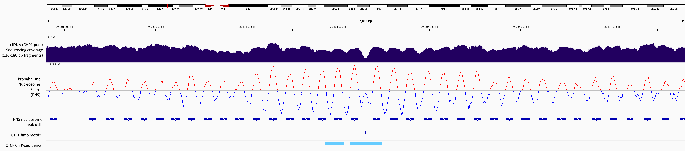

# PNS with Nucleosome + Breakpoint Peak Calling

Tools for fragmentomics scoring and peak calling from paired-end BAM files. The primary script computes a **PNS (Probabilistic Nucleosome Score)** track per base, plus coverage and dyad tracks, smooths the PNS signal, and calls:

- **Positive peaks** → **nucleosome regions**
- **Negative peaks (troughs)** → **breakpoint peaks** (called by flipping the sign and re-using the same peak caller)

---

## Table of Contents

- [Overview](#overview)
- [Requirements](#requirements)
- [Concept: PNS scoring](#concept-PNS-scoring)
- [Script usage](#script-usage)
  - [Basic examples](#basic-examples)
  - [Arguments](#arguments)
  - [How contigs / regions are processed](#how-contigs--regions-are-processed)
- [Outputs](#outputs)
  - [1) Combined per-base scores bedGraph](#1-combined-per-base-scores-bedgraph)
  - [2) Nucleosome regions (positive peaks)](#2-nucleosome-regions-positive-peaks)
  - [3) Breakpoint peaks (negative peaks)](#3-breakpoint-peaks-negative-peaks)
  - [Converting to bigWig / bigBed](#converting-to-bigwig--bigbed)
- [Conda / Mamba environment setup](#conda--mamba-environment-setup)

---

## Overview

The pipeline (high level):

1. Reads **paired-end fragments** from one or more BAM files across contigs or user-specified regions.
2. Filters duplicates by fragment coordinates to **max N duplicates** (`--max-duplicates`).
3. Optionally subsamples fragments (`--subsample`).
4. For each fragment whose length is within `[--frag-lower, --frag-upper]`:
   - Adds a **precomputed, length-specific PNS kernel** across the fragment footprint.
   - Builds a **coverage** track (+1 for each covered base).
   - Builds a **dyad** track (+1 at fragment center).
5. Smooths the PNS track using **Savitzky–Golay** (window=21, polyorder=2).
6. Calls peaks/regions on the smoothed track:
   - **positive regions + maxima** → nucleosome regions
   - **negative troughs** (by sign flip) → breakpoint peaks
7. Writes:
   - `*_combined_scores.bedGraph` (multi-column per-base track)
   - `*_nucleosome_regions.bed` (positive peak regions and metrics)
   - `*_breakpoint_peaks.bed` (negative peak regions and metrics)


---

## Requirements

### Python
- Python 3

### Required Python libraries
- `numpy`
- `scipy`
- `pysam`
- `tqdm`

### Additional tools (optional but recommended)
- `samtools` (inspecting BAMs, indexing, etc.)
- UCSC tools:
  - `bedGraphToBigWig`
  - `bedToBigBed` *(for peak call tracks)*

---

## Concept: PNS scoring

The script implements a **PNS scoring** approach:

- For each fragment length in `[frag_lower, frag_upper]`, a **kernel** is precomputed.
- The kernel is formed by:
  - building a **triangle distribution** across the first `mode-length` bases,
  - mirroring it from the fragment end,
  - summing start + end triangles,
  - and **mean-centering** so the kernel has ~0 mean (prevents baseline drift).
- For fragments shorter than `mode-length`, the kernel is expanded symmetrically so the “mode window” still fits.

This produces:
- **positive signal** within nucleosome-protected fragments (internal region),
- **negative flanking contribution** associated with fragment ends,
- a smooth **interference-like track** when summing many fragments.

A dyad track (fragment center counts) is provided separately for conventional interpretation.

---

## Script usage

### Basic examples

#### Whole genome (all contigs in BAM header)
```bash
python3 PNS_with_nucleosome_peak_calling.py \
  -b sample1.bam
```

#### Restrict to one contig
```bash
python3 PNS_with_nucleosome_peak_calling.py \
  -b sample1.bam \
  -c 2
```

#### Restrict to a genomic interval
Use `contig:start-end` (0-based coordinates; end is exclusive).
```bash
python3 PNS_with_nucleosome_peak_calling.py \
  -b sample1.bam \
  -c 2:100000-200000
```

#### Multiple BAMs
Fragments are pooled across BAMs.
```bash
python3 PNS_with_nucleosome_peak_calling.py \
  -b sample1.bam sample2.bam \
  -c 1
```

#### Stronger duplicate filtering + subsampling
```bash
python3 PNS_with_nucleosome_peak_calling.py \
  -b sample1.bam \
  --max-duplicates 1 \
  --subsample 0.25
```

### Arguments

| Argument | Meaning |
|---|---|
| `-b/--bamfiles` | One or more BAM files (paired-end) |
| `-o/--out_prefix` | Output prefix (default derived from BAM basenames + region info) |
| `-c/--contigs` | One or more contigs, optionally with ranges `chr:start-end` |
| `--mode-length` | Mode fragment length used to define kernel geometry (default: 167) |
| `--frag-lower` | Lower fragment length (inclusive) (default: 127) |
| `--frag-upper` | Upper fragment length (inclusive) (default: 207) |
| `--max-duplicates` | Maximum duplicated fragments allowed per identical coordinate tuple (default: 1) |
| `--subsample` | Keep each fragment with probability `p` (e.g. `0.5`) |

### How contigs / regions are processed

To scale to whole-genome BAMs, the script processes data in sliding windows:

- Default window length: **100,000 bp**
- Overlap padding: **1,000 bp** on both sides

For each window, scoring is computed on an **adjusted region** including overlap so smoothing + peak calling near window edges remain valid. Output writing then trims back to the **original non-overhang window**.

---

## Outputs

All outputs are prefixed with:

```
<out_prefix>_mode<MODE>_lower<LOWER>_upper<UPPER>
```

### 1) Combined per-base scores bedGraph

**File:**
```
<out_prefix>_..._combined_scores.bedGraph
```

**Format (tab-separated):**
1. `chrom`
2. `start`
3. `end`
4. `coverage` *(integer)*
5. `pns_smoothed` *(float)*
6. `pns` *(float)*
7. `dyad` *(integer)*

Each row is one base (`end = start + 1`).

Example:
```
chr2    100000  100001  42  3.75  3.80  11
```

---

### 2) Nucleosome regions (positive peaks)

**File:**
```
<out_prefix>_..._nucleosome_regions.bed
```

This is a BED-like peak/region call file containing per-region and per-peak metrics.

**Columns:**
1. `chrom`
2. `region_start`
3. `region_end`
4. `prominence_score`
5. `adjusted_peak` *(region midpoint; stable center-of-region coordinate)*
6. `upstream_flank_score`
7. `upstream_flank_pos`
8. `downstream_flank_score`
9. `downstream_flank_pos`
10. `peak_score` *(max within region)*
11. `peak_pos`
12. `max_coverage`
13. `max_coverage_pos`

**Prominence definition:**
```
prominence = peak_score - mean(upstream_flank_score, downstream_flank_score)
```
where flank scores come from the closest negative peaks surrounding the region (or fall back to peak itself if missing).

---

### 3) Breakpoint peaks (negative peaks)

**File:**
```
<out_prefix>_..._breakpoint_peaks.bed
```

This output has the **same column structure** as nucleosome regions, but represents **troughs** (negative peaks) in the smoothed PNS track.

Implementation detail:
- breakpoint calling is performed by flipping sign:
  - `flipped = -1 * pns_smoothed`
- the same positive-region logic is used on `flipped`
- in output, scores are flipped back so trough depth is represented consistently

---

## Converting to bigWig / bigBed

### Extract a single track column from the combined bedGraph

Example: extract **smoothed PNS** (column 5):
```bash
in="<prefix>_combined_scores.bedGraph"
awk 'BEGIN{OFS="\t"} {print $1,$2,$3,$5}' "$in" > PNS_smoothed.bedGraph
```

Example: extract **raw PNS** (column 6):
```bash
awk 'BEGIN{OFS="\t"} {print $1,$2,$3,$6}' "$in" > PNS_raw.bedGraph
```

Example: extract **coverage** (column 4):
```bash
awk 'BEGIN{OFS="\t"} {print $1,$2,$3,$4}' "$in" > coverage.bedGraph
```

### Make a chrom.sizes file

If you don’t already have one:
```bash
cut -f1 PNS_smoothed.bedGraph | sort -u | while read c; do
  max=$(awk -v chr="$c" '$1==chr{if($3>m)m=$3} END{print m+0}' PNS_smoothed.bedGraph)
  echo -e "${c}\t${max}"
done > chrom.sizes
```

### bedGraph → bigWig
```bash
bedGraphToBigWig PNS_smoothed.bedGraph chrom.sizes PNS_smoothed.bw
```

---

### Peak calls → standard BED6/BED12 (for bigBed)

The peak call files are BED-like and include extra columns. Convert to standard BED as needed.

Example: convert nucleosome regions to BED6 (score capped 0–1000):
```bash
infile="<prefix>_nucleosome_regions.bed"
outfile="${infile%.bed}.bed6"

awk 'BEGIN{OFS="\t"}
{
  chr=$1; start=$2; end=$3;
  name=chr ":" (start+1) "-" end;
  score=int($4+0.5); if(score<0)score=-score; if(score>1000)score=1000;
  strand="+";
  print chr,start,end,name,score,strand
}' "$infile" > "$outfile"
```

Then:
```bash
bedToBigBed <prefix>_nucleosome_regions.bed6 chrom.sizes <prefix>_nucleosome_regions.bb
```

Do the same for breakpoint peaks by substituting the filename:
```bash
bedToBigBed <prefix>_breakpoint_peaks.bed6 chrom.sizes <prefix>_breakpoint_peaks.bb
```

---

## Conda / Mamba environment setup

1. Installing Conda  
First, download and install Miniconda. Use the following commands to download the installer and run it:

```bash
# Download the Miniconda installer
wget https://repo.anaconda.com/miniconda/Miniconda3-latest-Linux-x86_64.sh

# Run the installer
bash Miniconda3-latest-Linux-x86_64.sh

# Follow the instructions to complete the installation and initialize Miniconda

# Once the installation is complete, activate the changes to your shell
source ~/.bashrc
```

2. Installing Mamba via Conda  
Mamba is a fast, efficient package manager that enhances Conda's functionality. It uses Conda as its underlying system but significantly speeds up package installation, dependency resolution, and environment creation.

Install Mamba using the following Conda command:

```bash
# Install mamba in the base environment
conda install mamba -n base -c conda-forge
```

3. Creating the PNS Environment  
Once Mamba is installed, you can create a new environment using the `PNS_with_dependencies.yaml` file, which contains all the necessary dependencies for this project.

```bash
# Create the PNS environment from the YAML file
mamba env create -f PNS_with_dependencies.yaml
```

4. Activating the PNS Environment  
After creating the environment, activate it with the following command:

```bash
# Activate the PNS environment
conda activate PNS_env
```

5. Verify Installation  
To verify that all dependencies are installed correctly, you can list all the installed packages in the PNS environment:

```bash
conda list
```

This will display all the packages and their versions in your environment.

6. Deactivating the Environment  
When you are done working, you can deactivate the environment by running:

```bash
conda deactivate
```


### Notes / gotchas

- Input BAMs must be indexed: each BAM requires a corresponding .bai index file in the same directory as the BAM.
- Coordinates in `-c contig:start-end` are interpreted as **0-based** with **end-exclusive** semantics (standard BED-like).
- Duplicate filtering is based on:
  ```
  (chrom, fragment_start, fragment_end)
  ```
  and allowed up to `--max-duplicates`.

